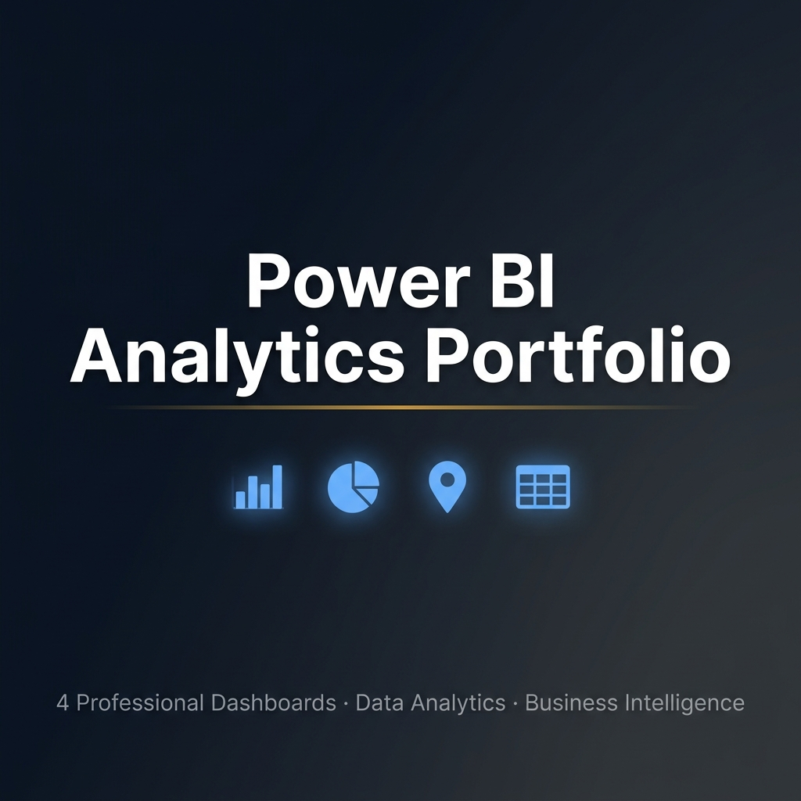
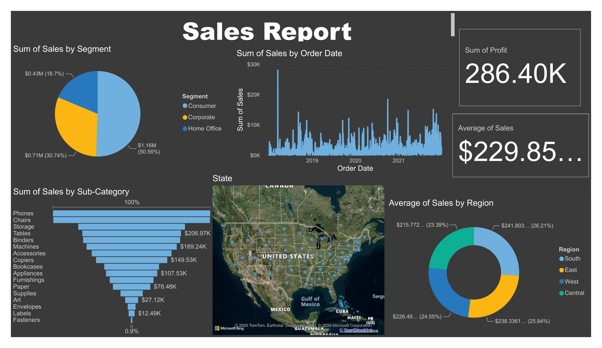
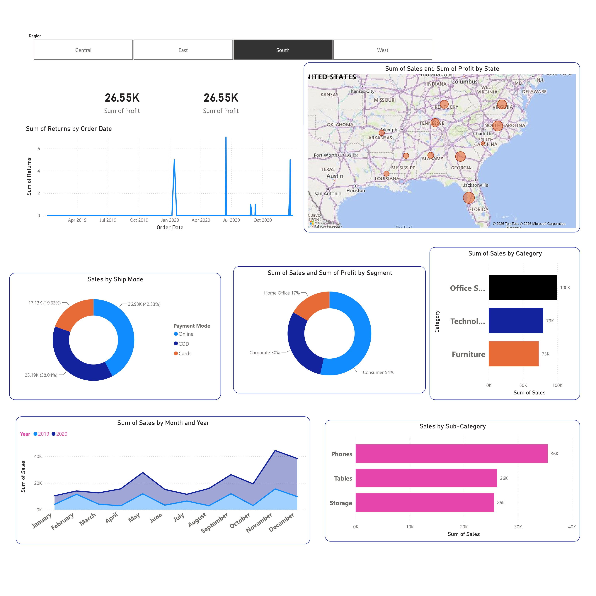
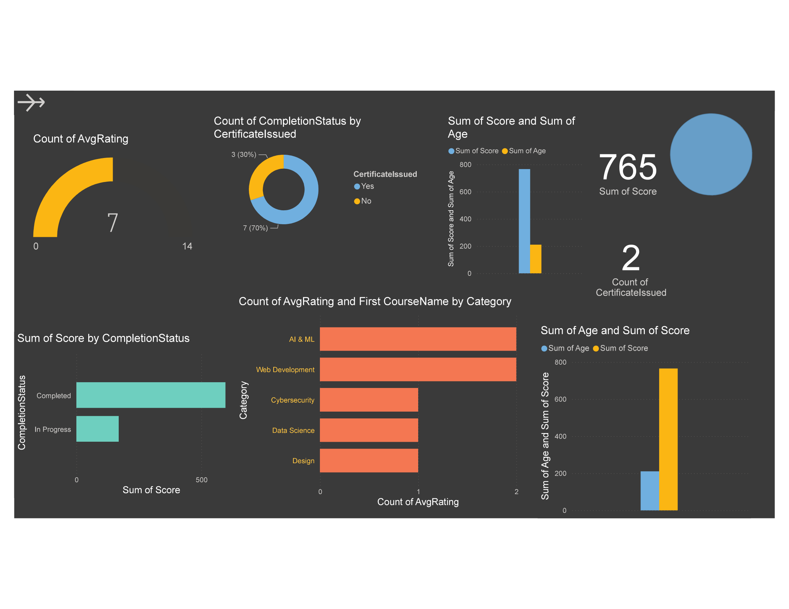
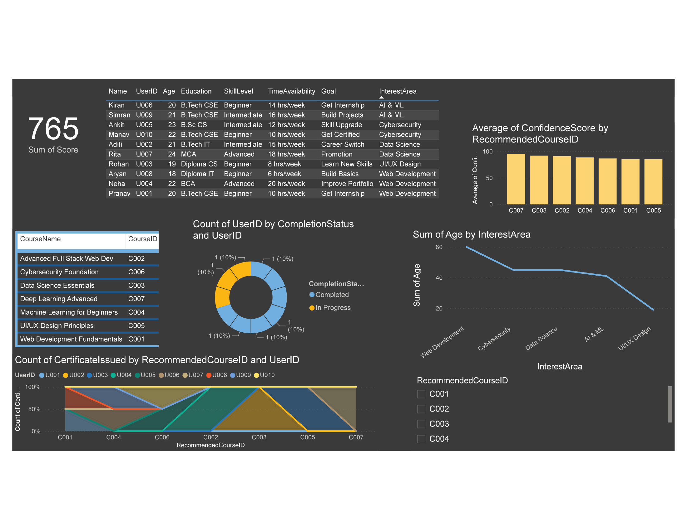
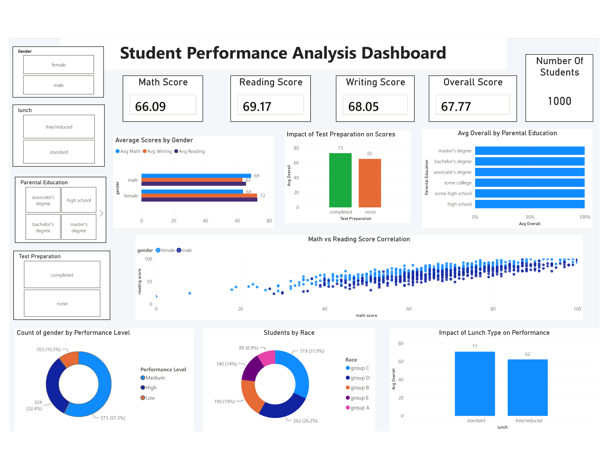

<<<<<<< HEAD

# 📊 Power BI Analytics Portfolio

A collection of **4 professional Power BI dashboards** covering Retail Sales, Student Performance, Course Recommendations, and Business Sales Analytics.

---

## 📂 Dashboards

### 🛒 1. SuperStore Sales Report
> Retail sales performance with segment analysis, geographic map, profit KPIs, and time-series trends.

**Dataset:** `SuperStore-Sales-DataSet.xlsx` — 5,902 rows × 23 columns

---

### 🎓 2. Student Performance Analysis
> Academic performance dashboard analyzing the effect of gender, parental education, test prep, and lunch type on scores.

**Dataset:** `StudentsPerformance.csv` — 1,000 rows × 8 columns

---

### 🖥️ 3. Course Recommendation System
> EdTech analytics tracking course completions, confidence scores, user profiles, and recommendation patterns.

**Dataset:** `Course_Recommender_Dataset.xlsx` — 58 users, 8 courses, 6 sheets

---

### 📈 4. Sales Analysis Dashboard
> Business sales analytics with regional breakdown, segment profitability, shipping modes, and seasonal trends.

**Dataset:** `Sales-Report-Dataset.xlsx` — 9,995 rows × 21 columns

---

## 🛠️ Tools Used

`Power BI Desktop` · `DAX` · `Power Query` · `Excel` · `CSV` · `Bing Maps`

## 🚀 How to Open

1. Clone or download this repository
2. Install [Power BI Desktop](https://powerbi.microsoft.com/desktop/) (free)
3. Open the `.pbix` file from any project folder
4. If prompted, reconnect the dataset from the `data/` subfolder
5. Refresh & explore

## 🎯 Skills Demonstrated

`Data Cleaning` · `Data Modeling` · `Power Query (M)` · `DAX Measures` · `Dashboard Design` · `Data Visualization` · `Business Intelligence` · `KPI Analysis`

---

## 📄 License

MIT © 2025 — see [LICENSE](LICENSE)
=======
# PowerBI-Analytics-Portfolio
4 professional Power BI dashboards covering Retail Sales, Student Performance, Course Recommendation, and Business Sales Analytics
>>>>>>> 1119a96965ace0090ef3b1051626a25da075a4ab
